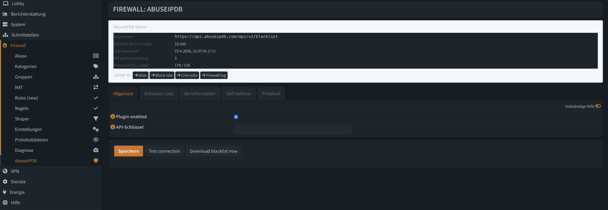
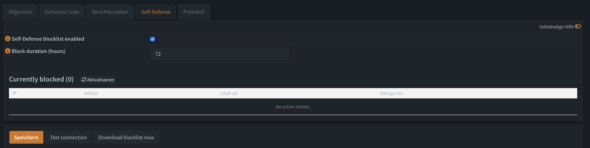
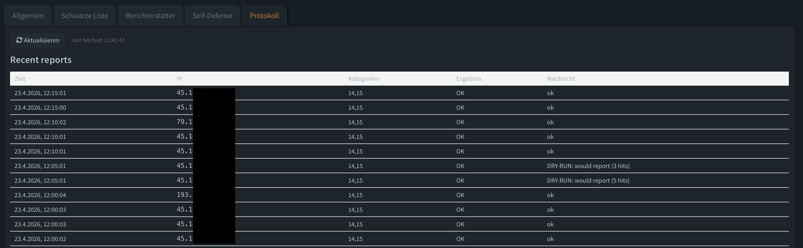
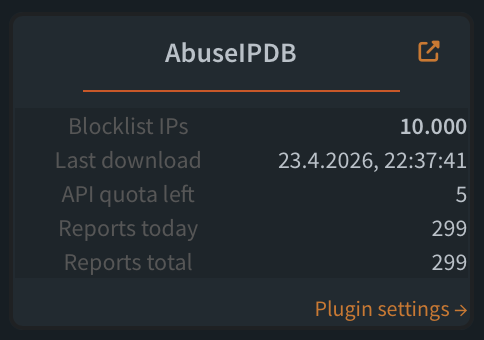

# os-abuseipdb — OPNsense AbuseIPDB Integration

OPNsense plugin for bidirectional [AbuseIPDB](https://www.abuseipdb.com) integration:

- **Blacklist** — downloads the AbuseIPDB blocklist into a pf table and auto-creates a firewall alias + WAN block rule.
- **Reporter** — parses the OPNsense firewall log and submits attacker IPs back to AbuseIPDB (bidirectional participation in the threat-intelligence network).
- **Self-Defense** — TTL-based local blocklist populated from reporter submits; closes the gap while AbuseIPDB's community catches up.
- **Dashboard widget** — live stats (blocklist size, last download, quota, reports).
- **Fire & forget** — cron jobs are created automatically when you enable the feature (daily download, 5-minute reporter cycles, hourly self-defense cleanup).

> **Status:** public beta (v0.2.0). Running in production on two OPNsense boxes. Looking for community testers — please open an issue or a r/opnsense reply with feedback.

## Screenshots

| Settings | Self-Defense live view |
|---|---|
|  |  |

| Report log | Dashboard widget |
|---|---|
|  |  |

## Installation

In the OPNsense shell (Console → option 8):

```sh
# 1. Install the Python dependency. The package name depends on the Python
#    version on your OPNsense: 26.1 LTS uses py311, newer builds py313.
#    Check with: python3 -c 'import sys;print(f"py{sys.version_info[0]}{sys.version_info[1]}-requests")'
pkg install -y py313-requests   # for Python 3.13 (OPNsense 26.1.5+)
# pkg install -y py311-requests # for older 26.1.x

# 2. Install the plugin
pkg add https://github.com/KaiOppi/os-abuseipdb/releases/download/v0.2.3/os-abuseipdb-0.2.3.pkg

# 3. Reload configd so the new actions become visible
service configd restart
```

Log out and back in to the WebGUI, then go to **Firewall → AbuseIPDB**.

## Configuration

### General

1. Tab **General**
   - Tick `Plugin enabled`
   - Paste your `API Key` (80-char hex, free tier at [abuseipdb.com](https://www.abuseipdb.com/account/api))
2. **Save** — the **Test connection** button verifies the key immediately.

### Blacklist

Tab **Blacklist** → enable.

On save the following is created automatically:
- Firewall alias `abuseipdb_blacklist` (type *External*)
- WAN block rule with source = the alias, logging enabled
- Cron job: daily download at 03:13

Default values (configurable):
- `Minimum confidence score` — 90 (only high-quality hits)
- `Maximum number of IPs` — 10000 (free-tier per-call limit)
- `Block on interface(s)` — WAN. Accepts either the internal identifier (`wan`, `opt1`, ...) or the friendly name from Interfaces → Assignments (`WAN`, `DSL`, ...). Multiple comma-separated entries turn the rule into a floating rule on the listed interfaces (multi-WAN / failover).

### Reporter

Tab **Reporter** → enable.

On save the following is created automatically:
- Cron job: reporter run every 5 minutes (parses `/var/log/filter/latest.log`)

Default values:
- `Dry-run` — **on**. Candidates are logged as "would report" but not actually submitted. Keep this on for 24h after enabling the reporter so you can verify the selected hits are real attack traffic.
- `Pre-check IP against AbuseIPDB` — **on**. Before reporting, the candidate IP is looked up via `/api/v2/check` and skipped if nobody else has flagged it (`confidence < precheck_min_confidence`). Costs one API call per candidate, dramatically reduces false positives.
- `Minimum hits before report` — 3 (dedupe against noise)
- `Rate limit per IP (min)` — 15 (max one report per IP per window)
- `Daily report quota` — 900 (below the free-tier 1000-per-day limit)
- `Default categories` — `14,15` (PortScan + Hacking)

> **Note:** IPs blocked by the plugin's own blacklist rule are **not** reported back (that would be circular reporting).

### Self-Defense

Tab **Self-Defense** → enable.

Every IP the reporter successfully submits to AbuseIPDB is also dropped into a **local** pf table `abuseipdb_selfcare` with a TTL (default 72 h). A second block rule — same interfaces as the blacklist rule — drops traffic from that table. An hourly cleanup cron expires entries whose TTL has passed.

This closes the window between "we saw the attack" and "AbuseIPDB's community-wide blacklist catches up with this IP". Attackers hitting you get blocked locally immediately.

Default values:
- `Block duration (hours)` — 72 (3 days; range 1 … 8760)

Trigger conditions for adding an IP to the self-defense table:

- **With pre-check on** (default): IP is added as soon as `/api/v2/check` confirms `confidence >= precheck_min_confidence` — independent of whether the report itself goes through. This means self-defense keeps filling even when the daily report quota is exhausted, the reporter is in dry-run, or AbuseIPDB temporarily rejects the submit. Pre-check uses its own AbuseIPDB endpoint quota (1000 `/check`/day on the free tier, separate from `/report`).
- **With pre-check off**: IP is added only after a successful real report, since there's no confidence signal otherwise (we won't blindly local-block on raw log hits).

The current self-defense list is visible directly in the **Self-Defense** tab under the settings ("Currently blocked").

## Dashboard widget

**Lobby → Dashboard → Add widget → "AbuseIPDB"** — shows blocklist size, last download time, API quota, reports-today/total.

## Verification

```sh
# Blocklist in pf table
pfctl -t abuseipdb_blacklist -T show | wc -l

# Stats as JSON
configctl abuseipdb stats

# Manual download (costs one API call)
configctl abuseipdb download

# Trigger reporter manually
configctl abuseipdb report

# Self-defense list in pf table
pfctl -t abuseipdb_selfcare -T show | wc -l

# Show active self-defense entries (with expiry timestamps)
configctl abuseipdb selfcare_list 100

# Run expiry cleanup manually
configctl abuseipdb selfcare_cleanup
```

## Uninstall

```sh
pkg remove os-abuseipdb
```

- The firewall alias and block rule **stay in place** (remove them manually if you want to).
- The state directory `/var/db/abuseipdb/` stays (holds report history in SQLite).

## Requirements

- OPNsense 26.1 or newer
- `py311-requests` or `py313-requests` (must be installed before `pkg add` — see [Installation](#installation))
- AbuseIPDB API key (free tier is enough for a single system)

## Roadmap

**Done:**
- [x] Plugin scaffolding + GUI
- [x] Blacklist downloader
- [x] Auto-setup of alias + block rule (multi-interface, floating)
- [x] Reporter (firewall log → AbuseIPDB) with dry-run, pre-check, noise filter
- [x] Cron integration (download + reporter)
- [x] Dashboard widget
- [x] Report log viewer in the plugin + refresh button
- [x] Quick-jump navigation to alias / rule / cron / log
- [x] FreeBSD pkg + GitHub release
- [x] Self-Defense local blocklist (TTL-based, auto-populated from reporter submits)

**Open:**
- [ ] Rule-to-category mapping UI (currently default categories only)
- [ ] IPv6 support in the reporter (currently IPv4 only)
- [ ] German translation (deferred to the Community Crowdin workflow)

**Later / post-1.0:**
- [ ] **Service-log integration** — catch attacks against local services (Postfix, sshd, WebGUI brute-force, FTP) by parsing their logs, not just firewall blocks. Optional auto-ban into the pf table so attackers are blocked and reported in one step.
- [ ] Suricata / Zenarmor integration (alert events as reporting source)
- [ ] GeoIP enrichment in the log viewer (ASN/country per IP)

## Changelog

See [CHANGELOG.md](CHANGELOG.md) for the full per-version history.

## Feedback / bug reports

- GitHub issues: <https://github.com/KaiOppi/os-abuseipdb/issues>
- Constructive feedback, feature ideas and bug reports are very welcome while the plugin is in beta.

## Acknowledgements

Developed with [Claude Code](https://claude.com/claude-code) as a pair-programming assistant. Architecture decisions, production testing, and every deployment to a live OPNsense were driven by the maintainer; Claude Code sped up the grind of boilerplate, scaffolding, and hunting down OPNsense-specific gotchas.

## License

BSD 2-Clause — see [LICENSE](LICENSE).

## Maintainer

Kai Schlestein · bartsi@gmail.com
